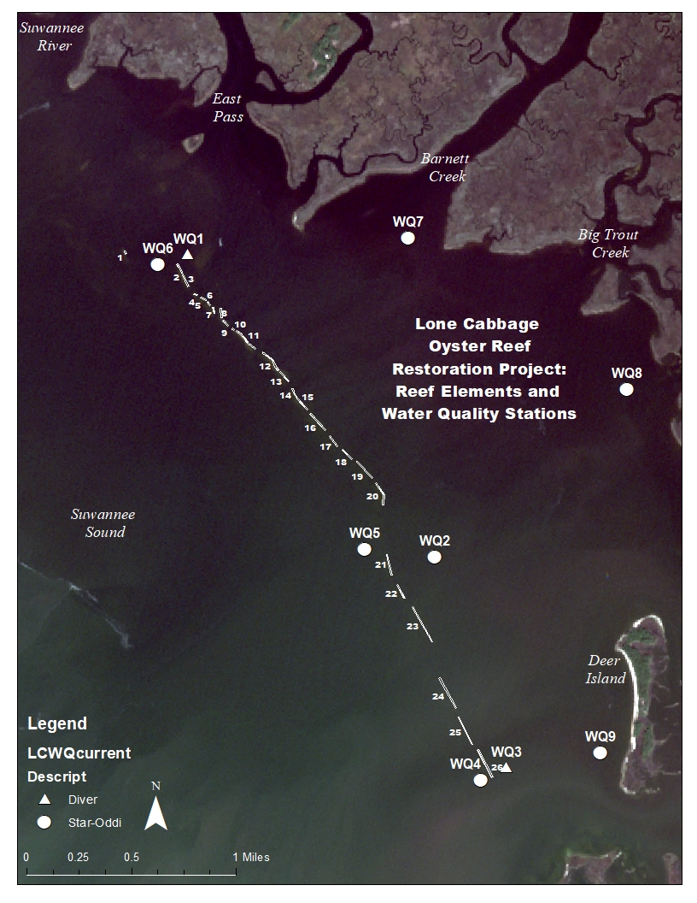
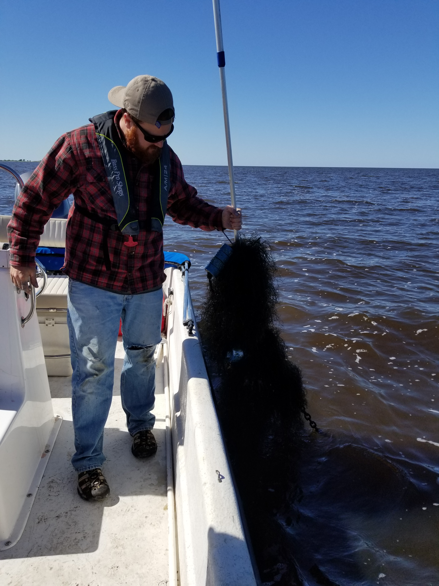
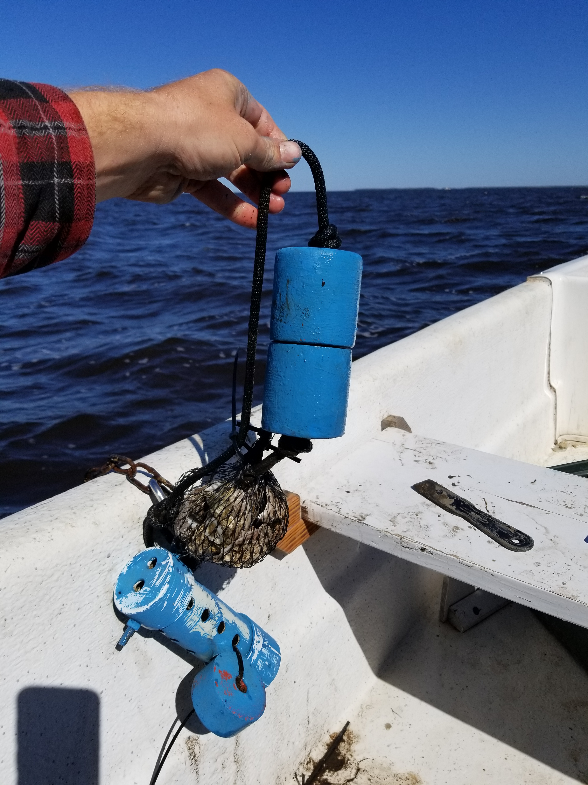
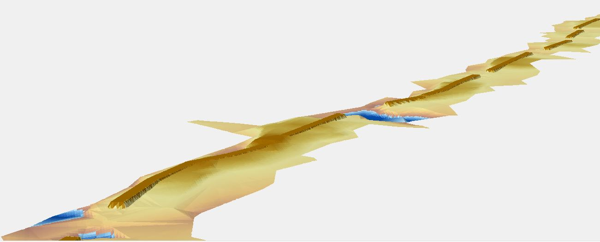
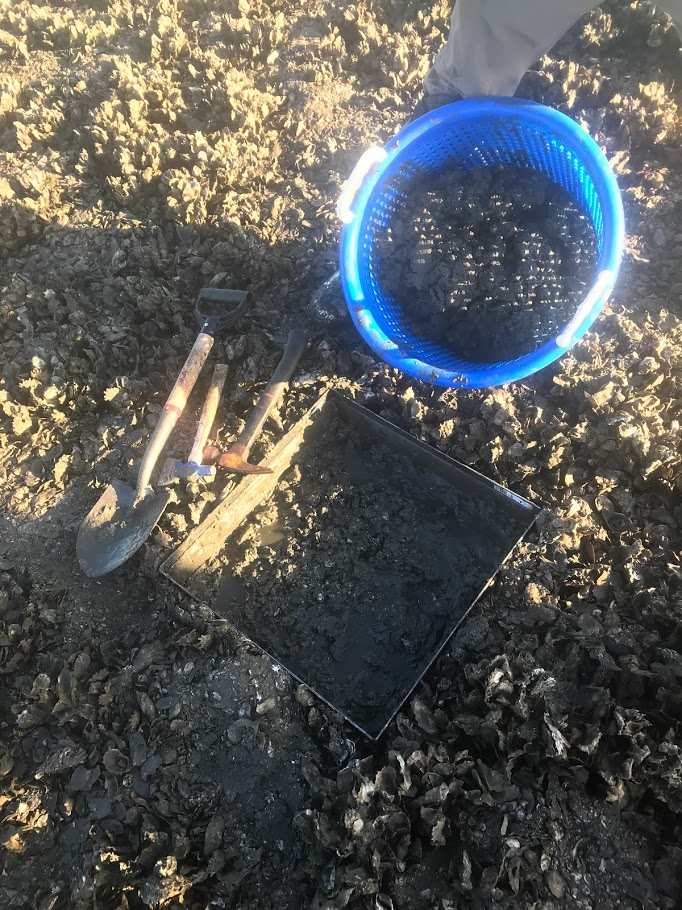
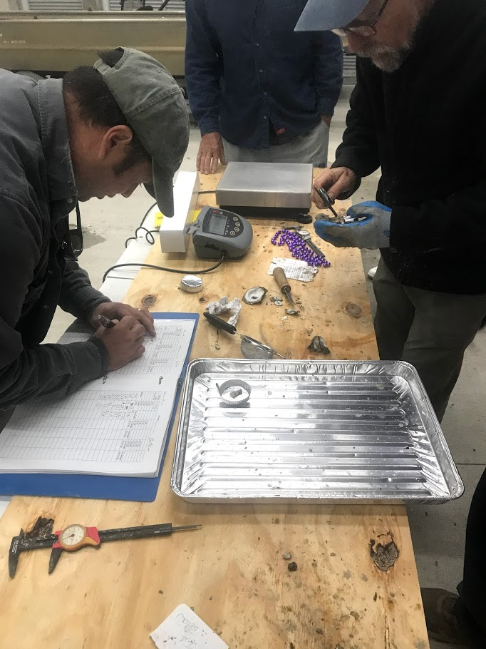

# Project

The goal - keeping estuaries resilient in the face of global change. The primary goal of this project is to restore degraded chains of reefs in a way that is resilient both to sea level rise, and to continued low flows from the river. By so doing, we predict healthy reefs will buffer the estuaries from fluctuations in salinity, and from coastal erosion. The effects of this buffering should cascade to the fish, shellfish, birds and plant communities that humans care about, under a variety of future climate and 
sea level conditions.

You can read more about the project here : 
[R.E.E.F](http://www.wec.ufl.edu/oysterproject/restoration.php)

# Data Collection

## Water Quality Monitoring

Continous data are collected in nine sites with Star-Oddi and Diver sensors. The sites are located around the Lone Cabbage Reef in Cedar Key, FL. Discete measurements are also collected at these sites. Sensors are secured to the ocean bottom, and record continously every hour on the hour.     
These data are provisional raw downloads from instruments and subject to revision following QA/QC procedures.  
Temperature and salinity (estimated from conductivity measures) are recorded hourly using CT sensors at stations 2 and 4-9, and CTD sensors at stations 1 and 3.  

Sensor data site links are arranged in the order they lay near the Lone Cabbage Reef from North to South and West to East.  
[Site 6](http://rpubs.com/oysterproject/site6measurements),    [Site 1](http://rpubs.com/oysterproject/site1measurements),    [Site 7](http://rpubs.com/oysterproject/site7measurements)
  
[Site 5](http://rpubs.com/oysterproject/site5measurements), [Site 2](http://rpubs.com/oysterproject/site2measurements), [Site 8](http://rpubs.com/oysterproject/site8measurements) 
  
[Site 4](http://rpubs.com/oysterproject/site4measurements),  [Site 3](http://rpubs.com/oysterproject/site3measurements), [Site 9](http://rpubs.com/oysterproject/site9measurements)     

[Discrete lab results](http://rpubs.com/oysterproject/alllabresults) ,processed by Lakewatch UF, are available for Sites 1 through 6, for 2017.

[Salinity and temperature figures](http://rpubs.com/oysterproject/allsalplots) are available for all nine site locations.  

Site data can be compared in the [Shiny App](https://oysterprojectck.shinyapps.io/mels-shiny/).  

    
[(left) Steve B, Research Coordinator, retrieving a sensor covered in red algae, (right) spat collector being attached to a sensor deployment canister]  

## Oyster Bed Surveys and Proposed Reef

The proposed reef and oyster bed surveys can be viewed on the [Leaftlet Map](http://rpubs.com/oysterproject/map).

   

[Images above are 3D renderings of proposed oyster reef]

## Oyster Sampling Efforts

Oyster sampling is all surveyed near and along Lone Cabbage Reef. Surveys are conducted using quadrats, transects, and counts. Data for these surveys are currently being analyzed. 

   

  
    
 

<!DOCTYPE html>
<html>
<head>
  <title>leaflet-map-simple</title>
  <meta name="viewport" content="width=device-width, initial-scale=1.0">
  <meta charset="utf-8">

  <!-- Load Leaflet: instructions at http://leafletjs.com/download.html -->
  <link rel="stylesheet" href="https://unpkg.com/leaflet@1.1.0/dist/leaflet.css"
  integrity="sha384-Zh+y1U8o6/7ni8Mp8szvUfZjGeKKS10CGH3IlD6L1X+XwzYgQ1llOjw/Wslc0cma"
  crossorigin="anonymous">
  
  <!-- Load Omnivore plugin to convert CSV to GeoJSON format -->
  

  <!-- Position the map and title with Cascading Style Sheet (.css) -->
  
</head>
<body>

  <!-- Display the map and title with HTML division tags  -->
  
Sensor Map

  

  <!-- Create the map content with JavaScript (.js) -->
  
</body>
</html>

