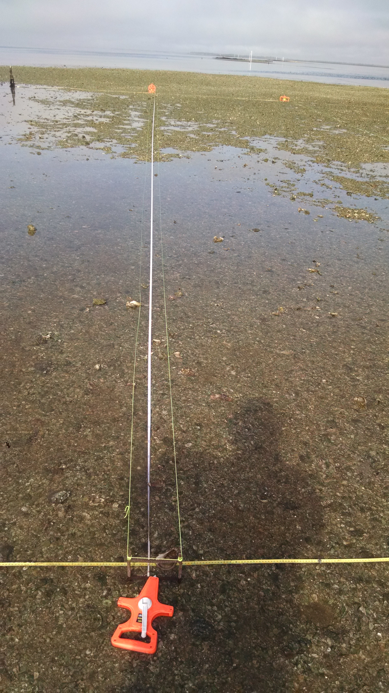
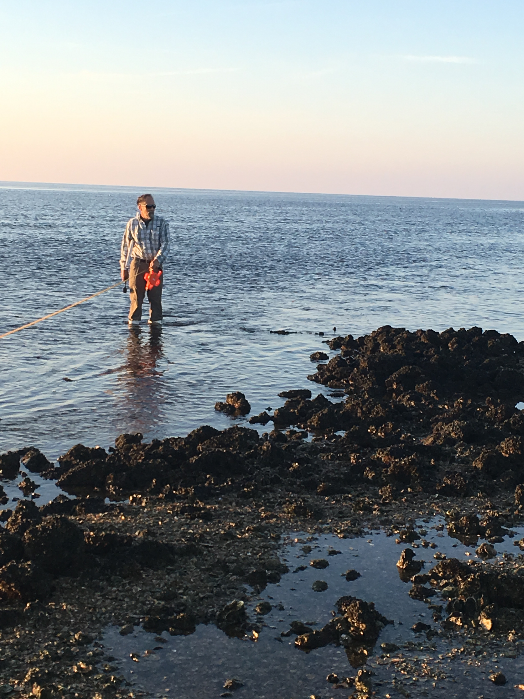
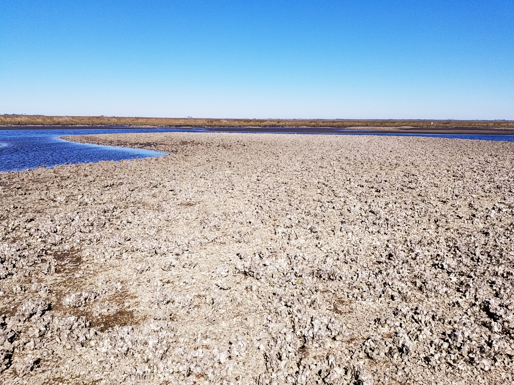
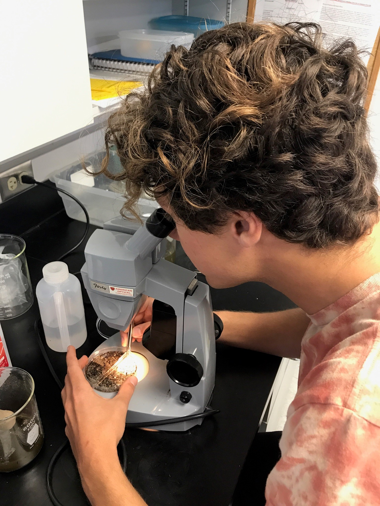
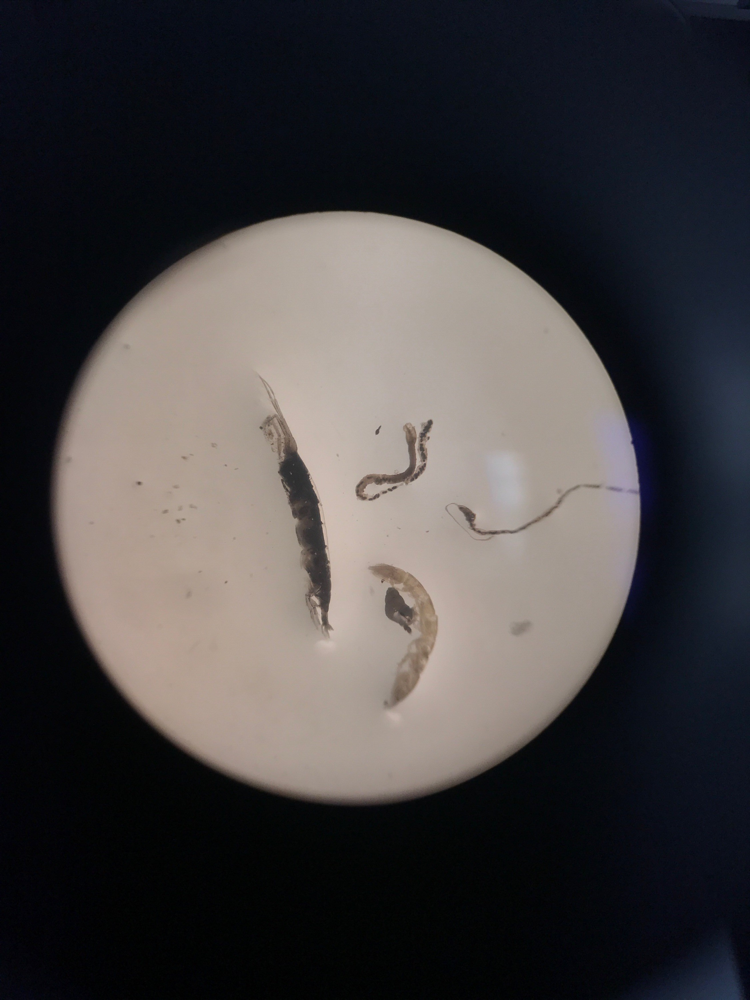

  
 
    
  
  
# **Project**

The goal - keeping estuaries resilient in the face of global change. The primary goal of this project is to restore degraded chains of reefs in a way that is resilient both to sea level rise, and to continued low flows from the river. By so doing, we predict healthy reefs will buffer the estuaries from fluctuations in salinity, and from coastal erosion. The effects of this buffering should cascade to the fish, shellfish, birds and plant communities that humans care about, under a variety of future climate and 
sea level conditions.

You can read more about the project here : 
[**R.E.E.F**](http://www.wec.ufl.edu/oysterproject/restoration.php)

# **Data Collection**

## **Oyster Sampling Efforts**

Oyster samples are collected randomly near and around Lone Cabbage Reef. Surveys are conducted using quadrats, transects, and live/dead oyster counts. Data for these surveys are currently being analyzed (May 2018). Below is a map of the sample areas.

### **Transect Sampling**

   
[(left)Transect sampling (Nov 2017), (right) Peter Fredrick, project advisor ] 

### **Quadrat Sampling**

   
[Random quadrat sampling (Jan 2018)] 

## **Oyster Bed Surveys and Proposed Reef**

Lone Cabbage Oyster Bed surveys, for select yeas, can be viewed on the [**Leaftlet Map**](http://rpubs.com/oysterproject/map).  

Click below to start the video for the Proposed Lone Cabbage Oyster Reef animation.  

<video src="pic/reefani.mp4" poster="pic/lc_ pads_3d_2nd.JPG" width="700" height="500" controls preload></video>

## **Water Quality Monitoring**

Continous data are collected in nine sites with Star-Oddi and Diver sensors. The sites are located around the Lone Cabbage Reef in Cedar Key, FL. Discete measurements are also collected at these sites. Sensors are secured to the ocean bottom, and record continously every hour on the hour.     
These data are provisional raw downloads from instruments and subject to revision following QA/QC procedures.  
Temperature and salinity (estimated from conductivity measures) are recorded hourly using CT sensors at sites 2 and 4-9, and CTD sensors at sites 1 and 3.  
 
Please click on the right map icon to select oyster beds surveyed for select years. The proposed oyster reef layer is also available for viewing.Oyster beds displayed are part of a Lone Cabbage sampling effort, and not representative of all oyster beds in Cedar Key, FL. Click on each sensor to view its continous and/or discrete water quality data.  

<iframe seamless src="html/intermap.html" width="100%" 
height="750"></iframe>

[**Discrete lab results**](http://rpubs.com/oysterproject/alllabresults) ,processed by Lakewatch UF, are available for Sites 1 through 6, for 2017.

[**Salinity and temperature figures**](http://rpubs.com/oysterproject/allsalplots) are available for all nine site locations.  

Site data can be compared in the [**Shiny App**](https://oysterprojectck.shinyapps.io/mels-shiny/).  

  
[(left) Steve B, scraping barnacles off sensor containers, (right) perparing water quality samples for Lakewatch UF]  

[Lab Technician Mel M retrieving sensor data from water quality sites] 

## **Benthic Sampling**

Benthic samples are collected at the nine water quality sites, and are currently being processed (May 2018).     

   
[(left) Undergraduate Technician Steve L processing benthic samples,(right) microscope view of benthic sample]   

  

