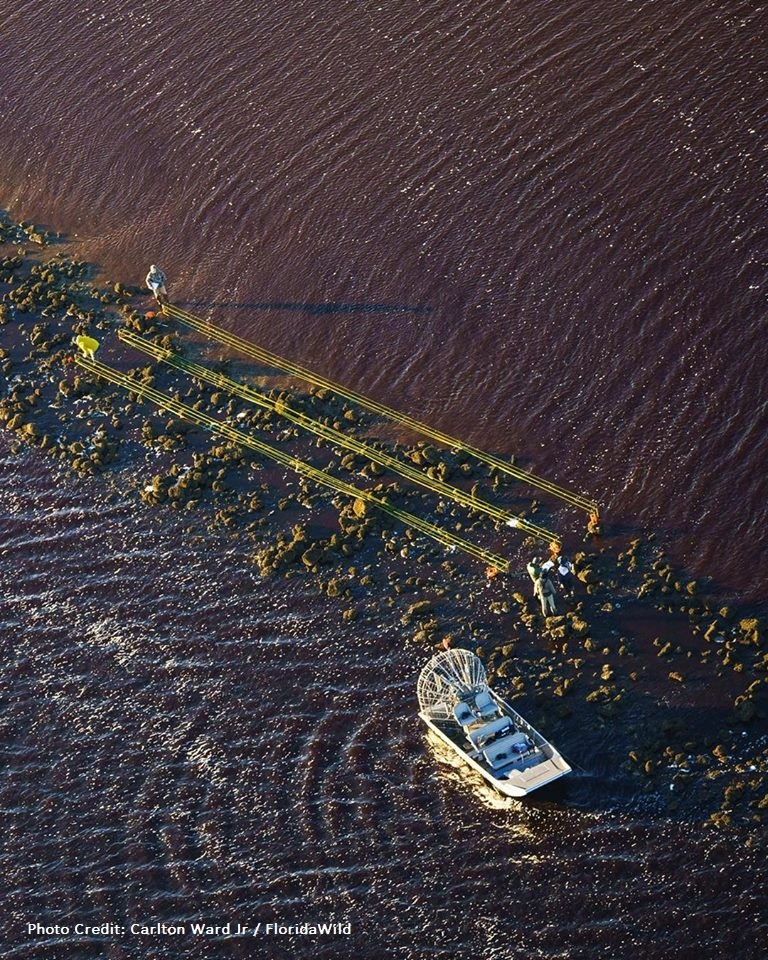
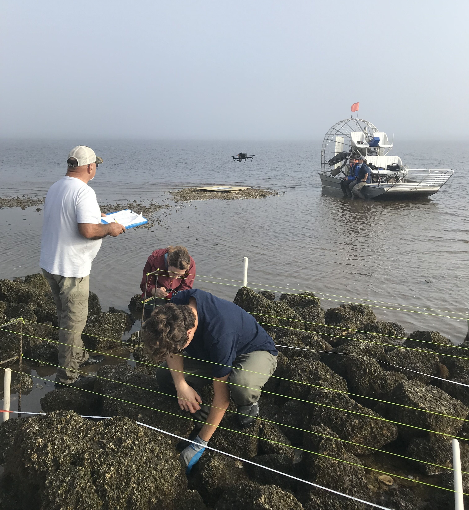
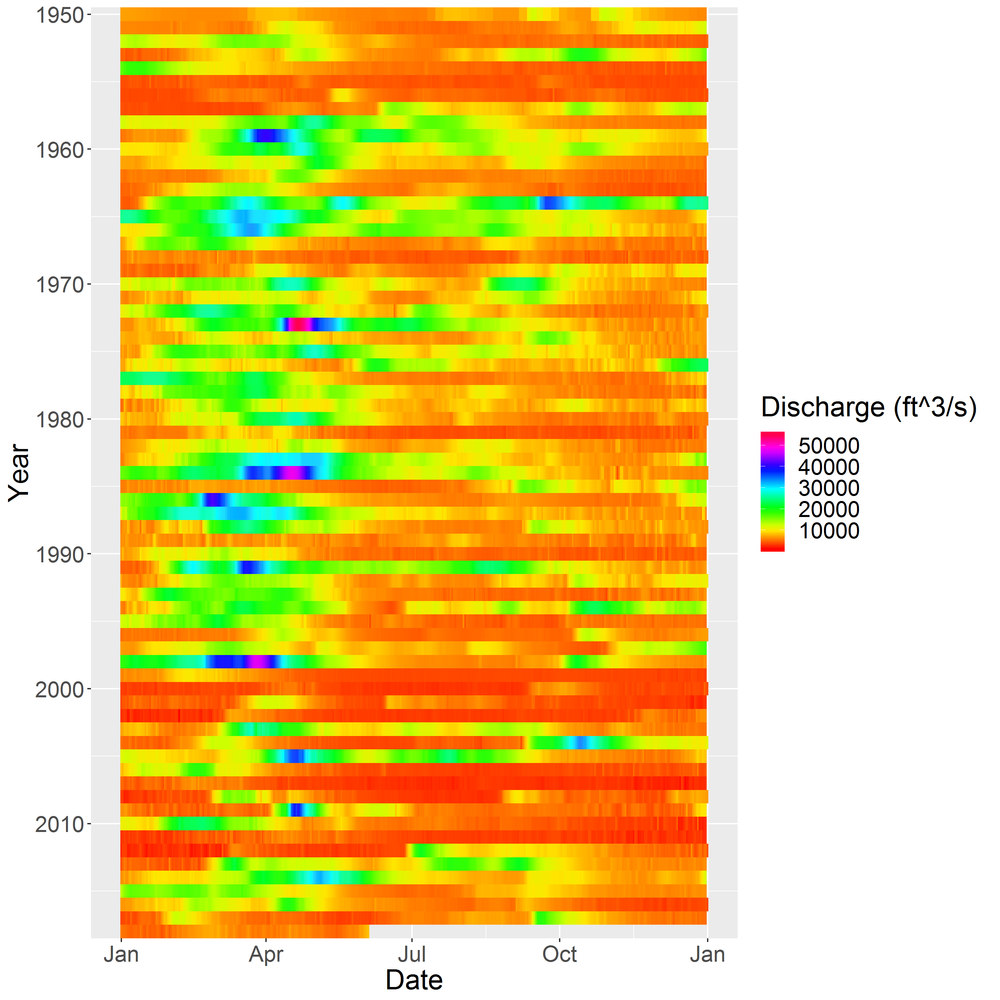
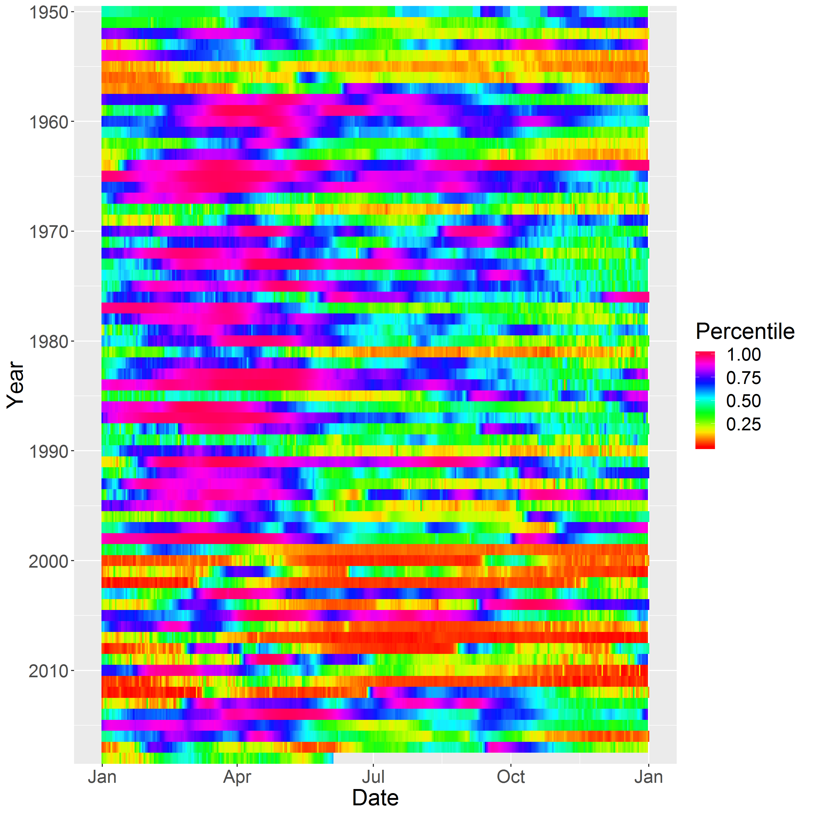

# [**Click here to be redirected to LCR Project Shiny App website**](https://oysterprojectck.shinyapps.io/wq_lcr_shiny_app/)
<iframe src="https://oysterprojectck.shinyapps.io/wq_lcr_shiny_app/" width="600" height="800"></iframe>
 
 
# **PROJECT**

**The goal -** keeping estuaries resilient in the face of global change. The primary goal of this project is to restore degraded chains of oyster reefs in a way that is resilient both to sea level rise, and to changes in river discharge. This project is predicted to have both ecosystem benefits in terms of enhancing shoreline protection, promoting estuarine conditions, and providing fish and wildlife habitat as well as local effects by providing sites for oyster spat to settle and grow.  Both objectives are of interest to local communities as well as management agencies.

You can read more about the project here : 
[**Oyster Restoration Project**](http://www.wec.ufl.edu/oysterproject/restoration.php)  
     
 You can check out more photos at **#oysterprojectck**.   
    
 
## **REEF CONSTRUCTION**
 
This project will restore about 32 acres (nearly three linear miles) of oyster reef along the historic Lone Cabbage reef complex. This will be done by placing locally sourced limestone rocks on the footprint of the old oyster reef to create a durable substrate for oyster spat to settle and grow.  The height of the restored reef will be similar to the surrounding natural oyster bars. In years when oyster survival is low oyster abundance on the reef will likely decline due to natural mortality - this is expected.  However, the rock core will persist, thus helping to promote estuarine conditions by detaining freshwater on the landward (east) side of the reef while also providing suitable substrate for oyster spat to recolonize the reef when conditions improve. As you can see, the reef will not be a single continuous reef, but instead we will follow the footprint of the relic reef that was first surveyed in the late 1800's.  This will create a "chain" of smaller reefs.  This is similar to other fringing "outside" oyster reefs along the Big Bend of Florida.  We are currently working with permiting agencies to plan the location of information signs as private aids to navigation in the area.  We have indicated on the map where these signs may be placed.
 
  
The map below displays the navigation markers on Lone Cabbage Reef. 
  

 
 

[Aerial view of constructed reef elements, Photo Credit: Carlton Ward Jr / FloridaWild] 
 
 
Click below to start the video for the Proposed Lone Cabbage Oyster Reef animation. The animation starts from the south end of the reef, and represents what the restored oyster reef will look like as if you are "flying" from the south to the north.  The actual top of the reef will be located at the same elevation as nearby wild oyster bars.  
<video src="pic/reefani.mp4" poster="pic/lc_ pads_3d_2nd.JPG" width="600" height="500" controls preload></video>
 
 
## **OYSTER SAMPLING EFFORTS**
 
Oyster surveys are conducted on intertidal oyster reefs using quadrats and line-transects at multiple locations in Suwannee Sound.  These locations are determined based on the distance of the sites from the mainland (localities = inshore, nearshore, and offshore oyster bars) and then replicate samples are taken at individual oyster bars within each locality.  In general we measure size structure, density, and the ratio of live:dead oysters. Data for these surveys are currently being analyzed (February 2020) and will provide a snapshot of oyster density on different reefs prior to construction. Below is a map of the sample areas.

 
### **TRANSECT SAMPLING**
 
Transect sampling is a key approach to categorizing oyster populations. Transect sampling is currently ongoing (February 2020). Winter sampling has concluded and now Summer sampling will continue is a few months. Groups of 5-8 students/volunteers count oysters in randomized transects, which are located on, inshore, and offshore of Lone Cabbage Reef.  
 

 
  
[(top images) Transect sampling (Jan 2019), (bottom image) Photo Credit: Kwan K] 

 

## **LANDINGS DATA**

FWC commercial landings in Florida data can be found here: [**FWC LANDINGS**](http://myfwc.com/research/saltwater/fishstats/commercial-fisheries/landings-in-florida/). We have included landings information here as a visualization of trends in oyster landings, oyster fishing trips, and oyster CPUE from key oyster fishing areas in the State of Florida. 
 
 
Below is the Shiny App of the Landings data from the State of Florida, Apalachicola, and Suwannee Sound.  
 
# **Click on the image below to be redirected to the Shiny App webpage**. 
 
 

 
## **RIVER DISCHARGE**
 
The Suwannee River is the primary surface water source of freshwater discharge into Suwannee Sound.  We use the waterData package in R to retrieve river discharge data from the USGS gauge 02323500 (Wilcox) gauge.  This gauge is located in the Suwannee River upstream of the tidally influence region of the Suwannee River.  In this graph we are showing mean daily discharge in cubic feet per second (by convention) to represent trends in discharge in the Suwannee River to Suwannee Sound.
 
 
Below is the Shiny App for the Qauntile Suwannee River Discharge data.  
 
# **Click on the image below to be redirected to the Shiny App webpage**. 
 
 

 
We are working on a variety of ways to help visualize long-term trends in Suwannee River discharge from the Wilcox gauge.  The graph on the left has year on the vertical axis and month of the year on the horizontal axis.  Each "row" on the graph represents a different year and each column would be a different month.  The colored boxes represent the river discharge for that month and year combination.  You can identify the discharge by looking at the color scale legend.  The graph on the right is a similar graph, but instead of the river discharge we have plotted the discharge quantiles.  The 50% quantile is the median value.  Values between the 25 and 75th quantiles are generally "normal" river discharge levels.  
 
  
 

## **WATER QUALITY MONITORING**
 
We collect key water quality parameters including temperature and conductivity on hourly time stamps at nine different locations near the Lone Cabbage Reef restoration site.  At a sub-set of these sites, we also collect discrete measurements of other variables including color, TN, and TP as part of ongoing coastal water quality monitoring efforts.  

 
  
[(left) Steve B, scraping barnacles off sensor containers, (right) perparing water quality samples for Lakewatch UF]  

[Lab Technician Mel M retrieving sensor data from water quality sites] 

 

 
  
  
  
  
  

